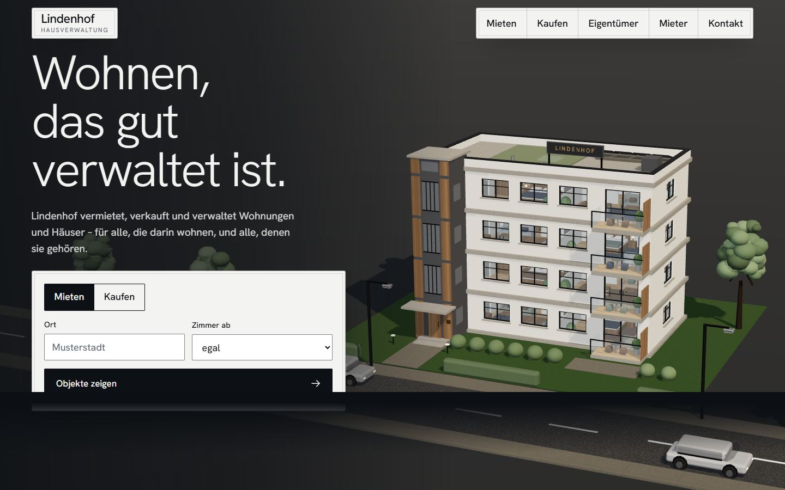
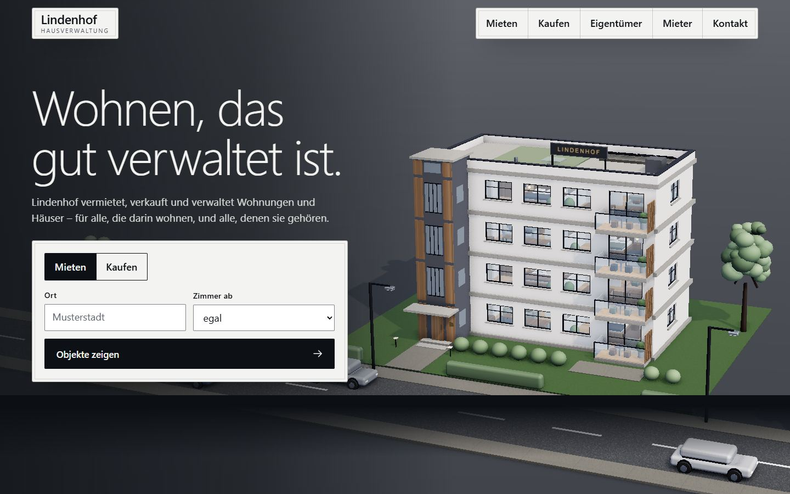

# Photorealism: the problem and a lighting spike

← [CLAUDE.md](../../../CLAUDE.md) · [research index](README.md) · next: [05 candidates](05-photorealism-candidates.md), [06 plan](06-photorealism-plan.md)

Checked 2026-10-08 on `main` at `fdf7cb6`. Screenshots in [assets/](assets/) were taken with `playwright-cli` against `npm run dev -- lindenhof` at 1440 px (390 and 820 px baselines were taken too and look the same in kind; they are re-shot for the real before/after set in phase 2).

## Repo facts confirmed or corrected

All of the maintainer's description holds. Corrections and additions:

- Installed versions: three **0.186.1** (r186), Astro 7.3.5, GSAP 3.15, Lenis 1.3.26. `sharp` is already present (Astro's image service), so frame encoding needs no new dependency.
- **Blender 5.2 is installed** (`C:Program FilesBlender FoundationBlender 5.2`, not on PATH, so a PATH check misses it), together with `uv`/`uvx` and the "MCP for Blender" add-on; the maintainer's `custom_tabletop` and `extraction_project` repos already use it. ffmpeg and Python are not installed. GPU: RTX 3090 Ti (24 GB), 16 threads. Node 24.
- `HDRLoader` is the current loader; `RGBELoader` is a 16-line deprecated alias. `UltraHDRLoader`, `EXRLoader`, `KTX2Loader`, `GLTFLoader`, `DRACOLoader`, `GTAOPass`, `OutputPass` all ship in r186 `examples/jsm`. The meshopt decoder is a 29 KB file with its WASM already base64-inlined.
- `export-site.mjs` inlines only `jpe?g|png|webp|svg|ico|gif|mp4|glb` found in `src`/`href`/`poster` attributes and CSS `url()`. Assets referenced from scripts (HDRI, GLB, frame sequences) are **not** inlined at all today; that is a gap, not just a missing MIME type.
- `playwright-cli` blocks `file:` URLs by default. The `export-site` skill tells the agent to test from `file://`, which therefore fails unless a config with `allowUnrestrictedFileAccess` and `--browser msedge` is passed (that worked in the spike). Phase 2 must ship that config.
- The first intake promise that cannot be kept today: Q3.6 and Q3.8 recommend "realistic", Q4.3 recommends the procedural route whose README states its own realism ceiling.

## Why it reads as cartoony

Seen in `lindenhof-hero-1440.jpg` and `lindenhof-neighbourhood-1440.jpg`, ordered by weight:

1. **Geometry is generic.** Boxes with flat slabs, no wall thickness at reveals, no gutters, drip edges, window sills with depth, no mullion profiles. Trees are 6 to 10 overlapping spheres on a stick. Cars are rounded boxes. Houses in the neighbourhood are identical wedges.
2. **No world around the subject.** The building floats on a dark void with a sharp ground edge. No sky, no horizon, no atmospheric falloff, no neighbours at distance, no vegetation texture.
3. **Materials are flat colour.** Plaster, grass and asphalt read as a single tone; the canvas-drawn textures are not visible at the viewing distance. No roughness variation, no dirt, no weathering, no normal detail, so nothing catches light differently from the next surface.
4. **Lighting is one note.** A hemisphere plus one sun with a `RoomEnvironment` at 0.32. No sky colour bouncing into shadows, no ground bounce, so shadow sides are grey, not blue-tinted and lit.
5. **No contact shading.** Only the sun shadow map exists: nothing darkens the corner where a wall meets the grass, under balcony slabs, behind the hedge. Objects look placed, not grounded.
6. **Tone is toy-like.** Saturated greens, a perfectly white plaster, ACES with no grade, no depth of field, no grain, no lens falloff.
7. **Camera.** A clean isometric-style orbit shows the model as a model. Photographs of buildings are taken from eye level, with converging verticals corrected and a deliberate foreground.

## Spike: how far does lighting alone get

Throwaway copy of the example outside the repo (`scratchpad/spike`): Poly Haven `kloofendal_48d_partly_cloudy_puresky` 1k `.hdr` (1.44 MB, CC0) via `HDRLoader` and PMREM at intensity 1.0, hemisphere light removed, sun reduced, plus three's `GTAOPass` followed by `OutputPass`. Same camera, hero anchor.

| Before | HDRI + GTAO |
|---|---|
|  |  |

What changed: the sky now lights the shadow sides, the façade is softer, there is a faint darkening where balconies meet the wall, and the background is lighter. What did not change: it still reads as a toy model. Roughly one fifth of the gap is closed, in line with items 4 and 5 above and with none of 1 to 3, 6 and 7.

**Conclusion that shapes the plan:** HDRI and AO are necessary and cheap, but they cannot rescue procedural geometry. Photorealism needs either real geometry and materials (glTF, scans) or an offline renderer (Cycles) that tolerates simple geometry because its light does the work. Both are far more than a lighting tweak, which is why the plan has tiers.

## Spike: file:// and frame data URIs

A 1280 x 720 test frame encoded with sharp at quality 72 (flat test image, so the sizes are meaningless): WebP, AVIF and JPEG each decoded through `fetch(dataUri)` then `createImageBitmap` and `drawImage` on a canvas, from a `file://` page in Edge (Chromium). All three worked. Firefox and Safari were **not** tested; that stays an acceptance item.

## Not measured

Real frame sizes of photoreal content, Cycles render times, GTAO cost on a phone, and anything in Firefox or Safari. Estimates in [05](05-photorealism-candidates.md) are marked as such.
