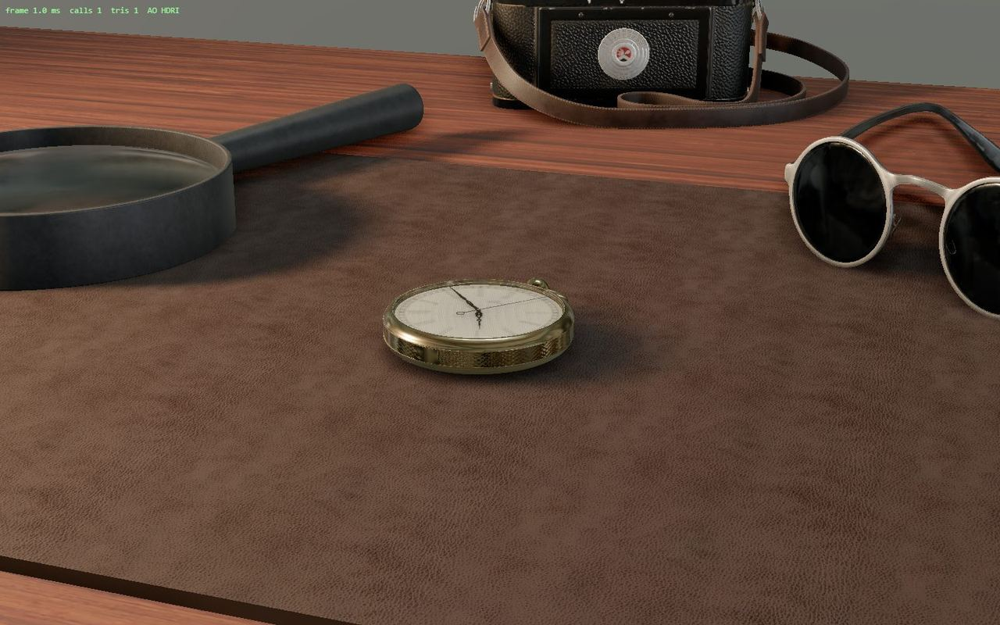
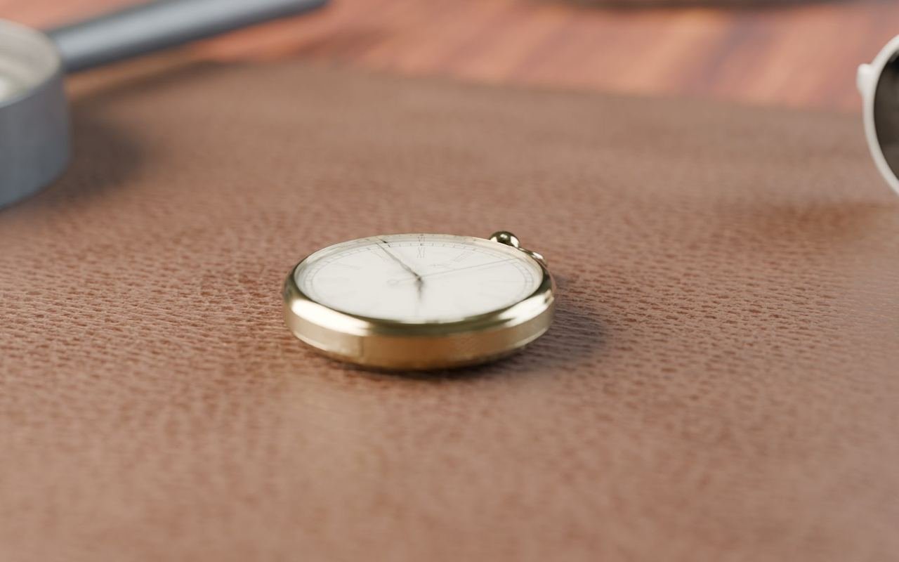
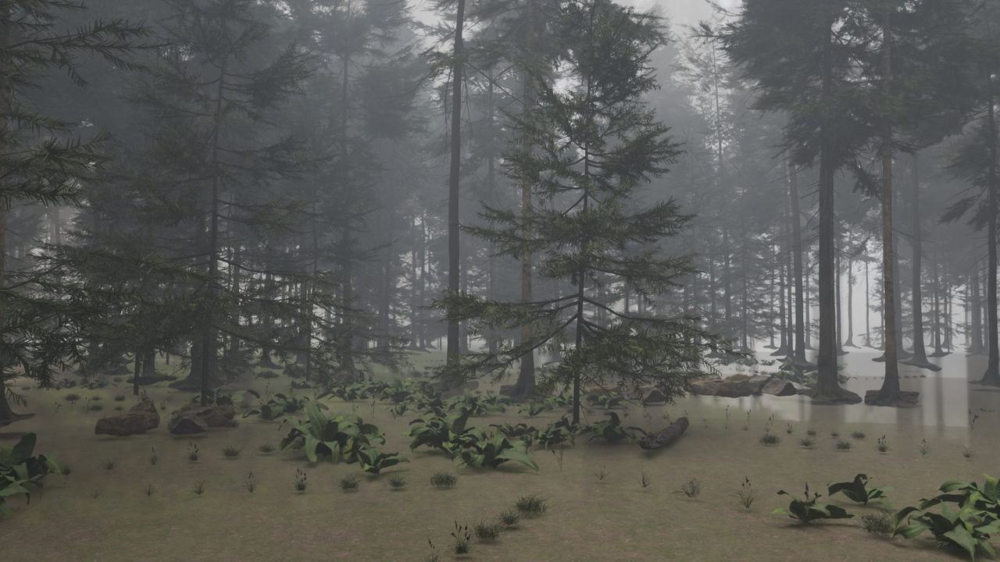
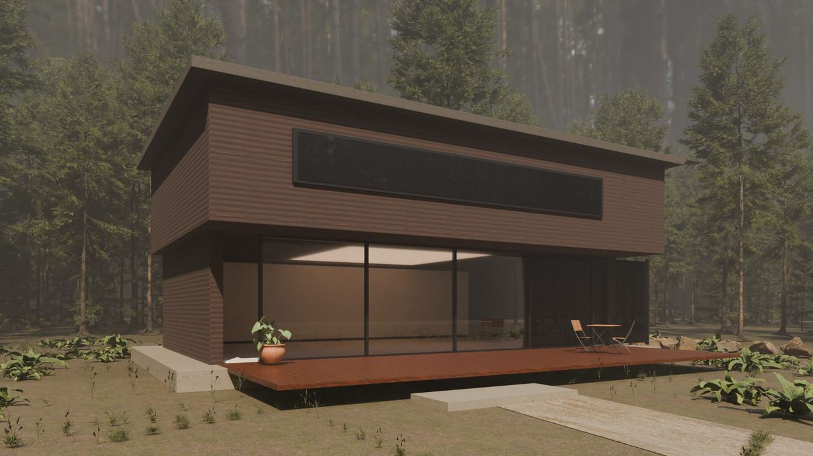

# Photorealism: quality spikes

← [CLAUDE.md](../../../CLAUDE.md) · [research index](README.md) · [04 problem](04-photorealism-problem.md) · [05 candidates](05-photorealism-candidates.md) · [06 plan](06-photorealism-plan.md)

Run 2026-10-08, before any framework change, to find out how good the tiers of [06](06-photorealism-plan.md) can get. Subjects were chosen freely (not `lindenhof`, not `oakline`): a watchmaker's desk, a misty pine forest, a forest house. All models, textures and HDRIs are CC0 from Poly Haven, downloaded once by hand-picked id. The spike sources are kept outside the repo (`exports/photoreal-spike/`, git-ignored, with a double-click gallery `index.html`); the useful parts move into branches B1 and B2.

## Results

| Tier | Result | Verdict |
|---|---|---|
| T2 real-time (three.js r186, GLB, HDRI, GTAO) |  | Good. Reads as a high-end product viewer, not as a photo. HDRI reflections and AO make most of the difference to the same scene without them. |
| T3 Cycles still, objects |  | **Photographic.** 1920 x 1200, 256 samples, 14 s on the RTX 3090 Ti. |
| T3 Cycles still, nature |  | **Very close to photographic.** Scanned firs, ferns, volumetric fog. 35 s. One artifact at the right edge (fog volume boundary). |
| T3 Cycles still, building |  | **Not yet.** A good architectural visualisation, not a photo. The house is my own box geometry; forest and materials are scanned. Black ribbon window, flat sun, wrong gravel texture. |

The two scroll-scrubbed sequences (60 frames each) ran from a single inline HTML file opened from `file://` in Edge with a clean console, 10 to 19 ms to the first frame.

## Numbers

| Measurement | Desk | Forest |
|---|---|---|
| Cycles frame, 1280 x 720, 48 samples, denoised | 4.3 s | 8.8 s |
| Desktop set, 60 frames, 1280 px, WebP q72 | 2.6 MB (43 KB per frame) | 3.9 MB (64 KB per frame) |
| Phone set, 30 frames, 800 px | 0.7 MB | 1.0 MB |
| Inline single file (with GSAP, base64) | 4.6 MB | 6.8 MB |
| Canvas draw per scroll step (local) | 0.1 to 0.7 ms | 0.03 ms |

- 120 frames extrapolate to about 5 to 8 MB and 9 to 18 minutes of rendering. This is **below** the estimate in [05](05-photorealism-candidates.md) (9 to 13 MB): soft gradients and depth of field compress well, sharp detailed frames will cost more. Treat 50 to 110 KB per frame as the planning range.
- Real-time props: four Poly Haven models 20.0 MB (2k, JPG) to **2.3 MB** (1k WebP, meshopt) via headless Blender; plus HDRI 1k 1.4 MB and desk textures 1.0 MB. Scene: 186k triangles, 53 draw calls. **Frame time was not measured**: the headless browser has no usable GPU timing, so T2 performance remains an acceptance item.
- Setup cost: importing the 487 MB `fir_tree_01` takes 24 s in Blender; the forest scenes take about 28 s to build before rendering.

## Findings that change the plan

1. **Scene realism is mostly asset quality.** Scanned materials and objects are photographic; hand-built geometry is the weak point. The plan must prefer CC0 scans and have the agent author as little geometry as possible. Buildings stay the hard case: M1 should test a building too, not only the furniture example.
2. **Poly Haven trees are unusable in real-time** (`fir_tree_01` 487 MB, `pine_tree_01` 958 MB as 1k glTF) but fine for Cycles. Real-time vegetation needs a different source or a decimation step.
3. **Phones need their own frames.** A 16:9 frame cover-cropped into a portrait screen shows only the centre. T3 needs a portrait-rendered set, not just smaller files.
4. **Blender WebP export fails silently on 1-channel images** (Poly Haven `glass_rough`): the GLB is written but references a missing image, and `GLTFLoader` then throws "Cannot read properties of undefined (reading 'uri')". Workaround used: export that model with JPEG. B2 needs a GLB validation step (every texture has an image) and a test.
5. **A world volume renders the sky black** (infinite path through fog). Fog must be a bounded volume box.
6. **Inline export pitfall:** `String.replace` with minified code as the replacement string corrupts it (`$&`, `$'` patterns); always use a function replacer. `export-site.mjs` already does; the spike builder did not.
7. **`playwright-cli` needs a config** for `file://` (`allowUnrestrictedFileAccess`) and `--browser msedge` on this machine (Chrome is not installed). Already in the plan (B1).
8. **Blender on this machine is 5.2.1 LTS** (not 5.2.2) and GPU-renders through OptiX; the `HIPEW` warning at start is harmless.

## What this means for the tiers

- T3 (rendered sequences) is confirmed as the route to photographic results and is cheaper in bytes and render time than feared.
- T2 is a good product viewer but should not be sold as photoreal; its tier description says so.
- Buildings need more than box geometry: either supplied CAD or renders, or a much more careful modelling pass with detail and light. This is the open risk before any building example.

## Resolution, sharpness and cost

The first scroll demos used 1280 px frames at 48 samples with WebP q72 and looked soft. One frame per scene was re-rendered at 1280, 1920, 2560 and 3840 px and encoded as WebP and AVIF (comparison page `exports/photoreal-spike/schaerfe.html`, git-ignored).

| Width | Render per frame (desk / forest) | WebP q82 | AVIF q62 (desk / forest) |
|---|---|---|---|
| 1280 | 4 s / 9 s | 69 / 99 KB | 52 / 83 KB |
| 1920 | 10 s / 26 s | 129 / 193 KB | 95 / 163 KB |
| 3840 | 44 s / 126 s | 332 / 589 KB | 242 / 499 KB |

- 1920 px is a clear step up from 1280; 3840 px is crisp down to needle texture and watch numerals. AVIF q62 shows no visible artefacts against WebP q82 at about 25 percent less size (AVIF decoding from a data URI on `file://` was verified in Edge in the earlier spike; Safari before 16.4 needs a WebP fallback).
- 60 frames at 1920 px AVIF: 5.7 MB (desk) and 9.8 MB (forest), 10 and 26 minutes of rendering. At 3840 px: 14.5 and 30 MB, 44 minutes and 2.1 hours. 120 frames double both.
- **Proposed rule:** HD (1920) is the default and the only set in the single-file export (cap 25 MB, so 60 frames, about 8 to 13 MB inline). 4K is an optional second set for hosted sites only, loaded on large or high-density screens with a good connection; it cannot fit the single file. The lazy upgrade path is untested.

**Measured HD sequences** (60 frames, 1920 x 1080, 128 samples, AVIF q62, 30-frame 960 px phone set included in the file):

| | Desk | Forest |
|---|---|---|
| Render time, 60 frames | 9.2 min | 25.9 min |
| Desktop set | 5.5 MB (89 KB per frame) | 10.1 MB (164 KB per frame) |
| Single inline file | 9.0 MB | 16.1 MB |
| Load all frames, first frame (local, Edge from `file://`) | 0.6 s, 79 ms | 0.7 s, 89 ms |

The forest file is above the 15 MB warning line but under the 25 MB cap. The inline file carries both the desktop and the phone set, so a phone also downloads the desktop frames; a hosted site would split them.
