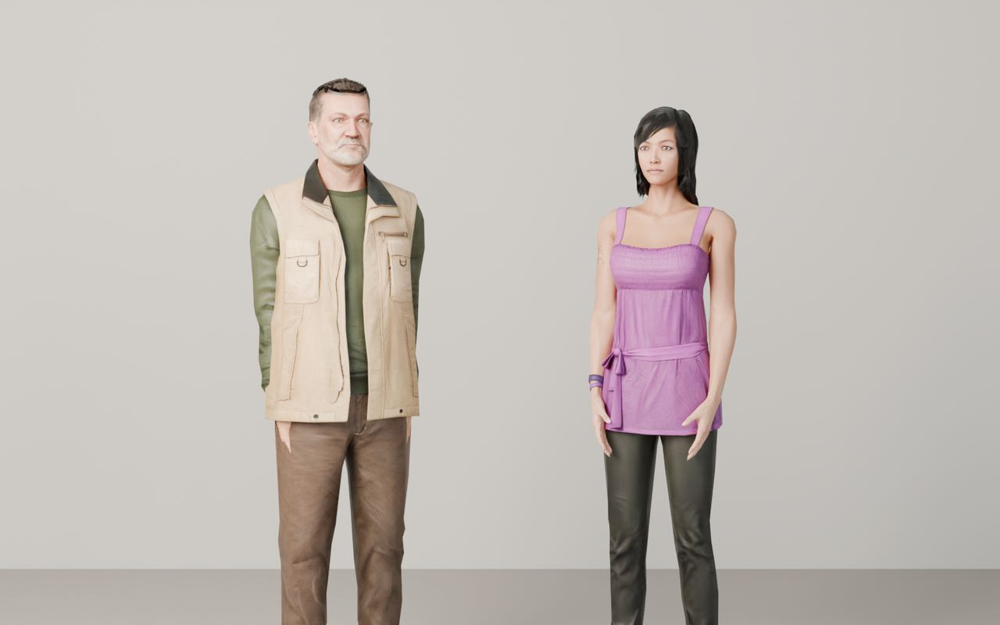
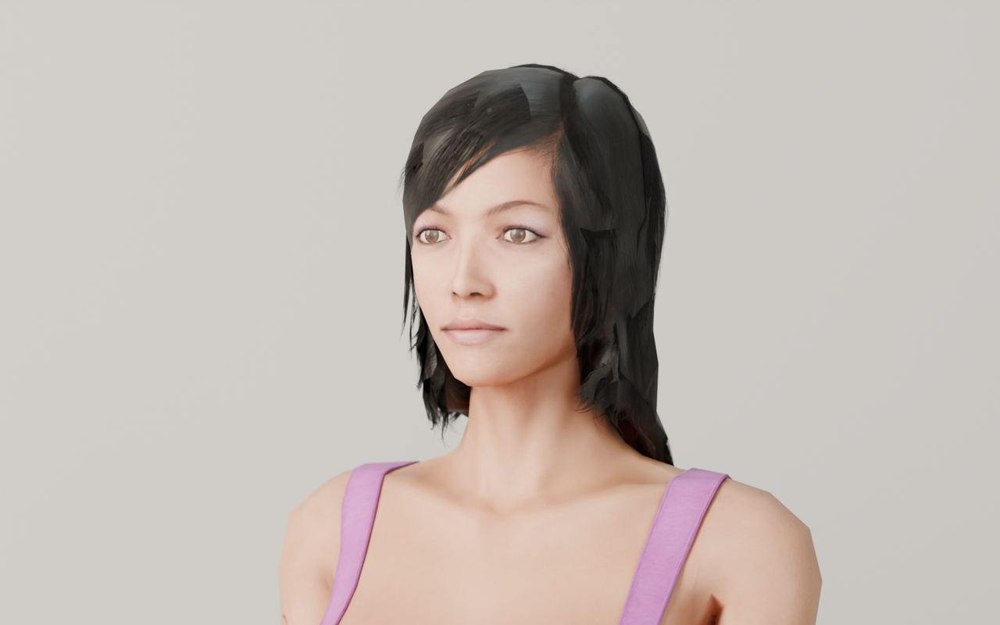
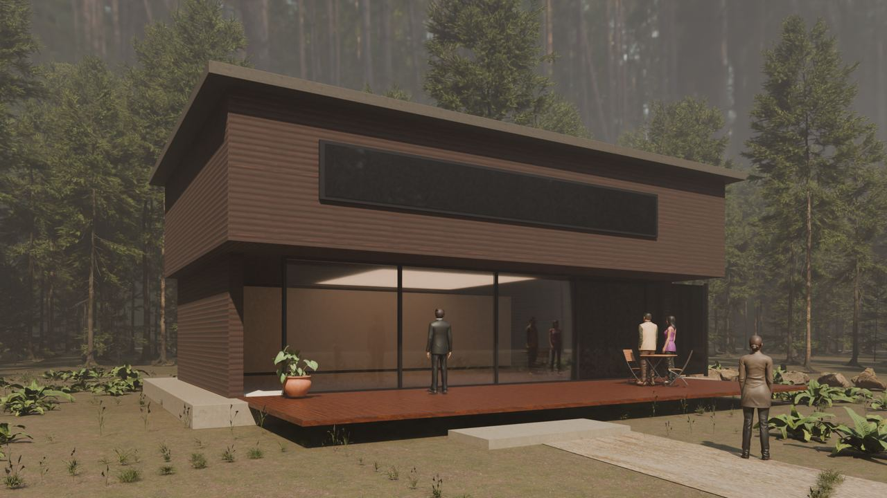
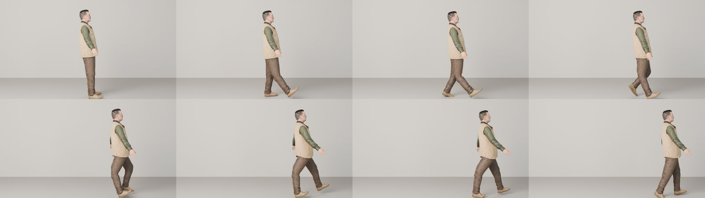
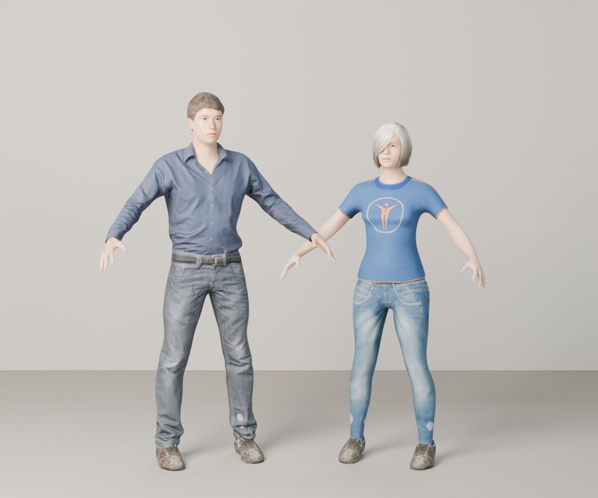
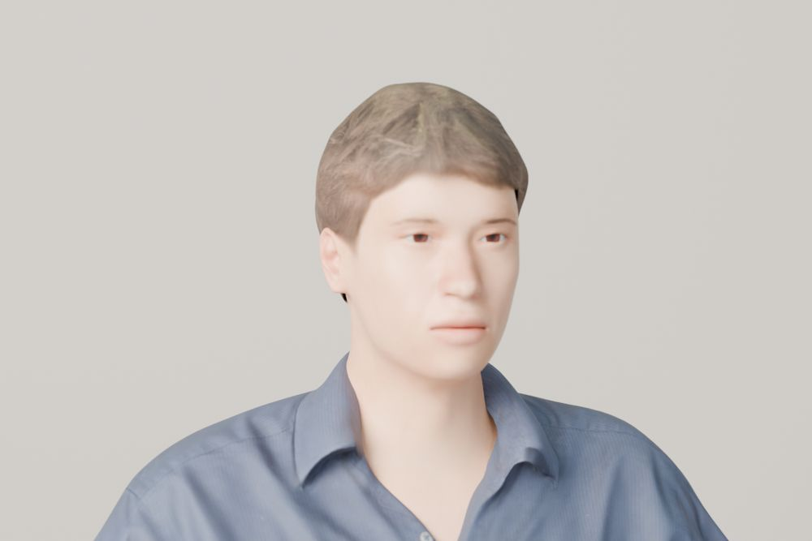

# People and characters

← [CLAUDE.md](../../../CLAUDE.md) · [research index](README.md) · [07 quality spikes](07-photorealism-quality-spikes.md) · decision [0020](../decisions/0020-human-figures.md)

Checked 2026-10-08. The earlier sites showed people as silhouettes or toy figures because the T0 kit has no human model. The realism tiers alone do not fix that: a human needs a real model, a skin and clothing material, and a pose. This note records what is allowed, what was tested and what is still missing. Not legal advice; Adobe and Microsoft can change their terms.

## Sources

| Source | Realism | Licence for client work | Verdict |
|---|---|---|---|
| **Microsoft Rocketbox** (115 rigged avatars: adults, children, professions) | game-era scans, believable faces and clothes at medium distance, hair is textured cards | **MIT** (`LICENSE.md`, 2020; README says "released under MIT License"). Keep the copyright notice with the site. Repo last pushed 2022 | **Adopted** for rendered frames and real-time. Fetched by `npm run assets -- add <site> people/<id>` |
| **Mixamo** (Adobe, free with an Adobe ID) | stylised game characters, strong animation library (walk, idle, talk) | Royalty-free for personal, commercial and non-profit projects. **Raw character and animation files must not be redistributed as standalone assets**; they must be baked into a project. Adobe may change terms or availability. No download API; needs the user's own login | **Conditional.** Only for rendered frames (T3: images only, no raw file ships). The user downloads the FBX in their browser with their own Adobe ID and puts it in `assets/people/<name>/`; never ask for the login in chat. **Not for real-time GLB** until the terms are clear. Retargeting Mixamo animation onto Rocketbox is untested (backlog) |
| **MPFB2 / MakeHuman** (Blender add-on) | customisable, generated in Blender, realistic base meshes | exported characters are **CC0**; community add-on assets can be CC-BY, check each. Code is GPL or AGPL, which does not affect the output | **Candidate.** Installing the add-on is an install outside this repo, so it needs the maintainer's yes; not built |
| **MetaHuman** (Epic) | highest realism, needs Unreal Engine to create | Epic states MetaHumans can be used with any engine or creative software under the Unreal licence terms; add-ons export to Blender. The browser creator is being retired in favour of the editor | **Backlog.** Heavy toolchain, terms to be read before use |
| **Quaternius** modular characters (CC0) | stylised low poly, used by `custom_tabletop` | CC0 | Only for stylised tiers (T0, T1) |
| Real people from client photos or video | real | the client's rights and the people's consent (GDPR) | The only honest route for portraits and testimonials; the agent never invents faces or names |

Sources: [Mixamo FAQ (Adobe)](https://helpx.adobe.com/be_en/creative-cloud/faq/mixamo-faq.html), [Mixamo licence summary](https://www.licenseorg.com/guide/3d-assets/mixamo), [Microsoft Rocketbox](https://github.com/microsoft/Microsoft-Rocketbox), [MPFB2 coverage](https://www.cgchannel.com/2025/03/check-out-open-source-blender-character-generation-plugin-mpfb-2), [MakeHuman licence](https://static.makehumancommunity.org/about/license.html), [MetaHuman licence](https://www.metahuman.com/en-US/license).

## What was tested

Four Rocketbox avatars in Cycles on the RTX 3090 Ti, textures converted from TGA to JPEG and PNG (5 to 12 MB per person):

| Shot | Result |
|---|---|
| Full body, two people, studio light  | Clearly not toy figures: faces, clothes with weave and wrinkles, skin with a little subsurface. 8 s at 1600 x 1000. |
| Close portrait  | Face and skin hold up; **hair is low-poly textured cards** with visible cut edges, and eyes are flat. Fine for medium distance, not for a hero portrait. |
| People in the forest house  | At architectural distance (figure about 150 to 250 px tall at 1920 px) the figures read as real people and give scale and life. |

Findings: arms must be lowered from the T-pose with the `Bip01 L|R UpperArm` bones (rotation about Y, plus and minus); `TZ` as a shell variable is swallowed by Windows (use another name); the man's hair opacity map shows a hard cut on top in close-up.

## Animation: Rocketbox first, Mixamo later if needed

The Rocketbox repository ships about 400 animation clips (walks in many styles, idles, breathing, coughing, talking gestures, sitting) on **the same skeleton as every avatar**, under the same MIT licence. No retargeting is needed, and no account: `npm run assets -- add <site> animations/m_walk_neutral_01` fetches one, `webdev_bpy.apply_animation(armature, name)` plays it. Test: a walk cycle of one avatar, eight frames from one clip:

The `xy` folder clips travel forward (the figure crosses the scene, as above); the `static` folder holds in-place idles and gestures. Mixamo would add variety (dance, fight, sports) but needs the user's Adobe login, a retarget from the Mixamo rig to the Rocketbox skeleton (untested) and the redistribution limits above, so it is the second choice, used only when a clip is missing from Rocketbox.

## MPFB2 (MakeHuman) tested

Installed from the Blender extensions platform into the Blender user folder (about 80 MB), plus the CC0 asset packs (system assets, skins, eyebrows, eyelashes, shirts, pants, shoes) and the CC-BY pack hair02: about 830 MB of downloads, extracted into `%APPDATA%\Blender Foundation\Blender\5.2\extensions\.user\blender_org\mpfb\data`. It runs headless: `HumanService.deserialize_from_dict` builds a clothed human from a dictionary (gender, age, skin, hair, clothes).

 

With default settings and no tuning the result is **not better than Rocketbox**: skin looks waxy, hair is plain (the bob is very pale, the short cut a simple cap) and faces are generic. Its strengths are variety (body shape, age, ethnicity, children), a pure CC0 output and scripting; its limit for this framework is the same as Rocketbox for close-ups. Verdict: keep Rocketbox as the default, keep MPFB2 installed as an option for body variety, do not build an integration now.

## Not done

Crowds, hair and eye improvements, clothes physics, a Mixamo importer and retarget, tuned MPFB2 materials and hair, MetaHuman.
